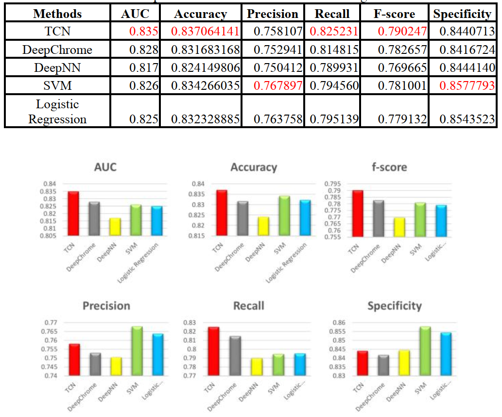
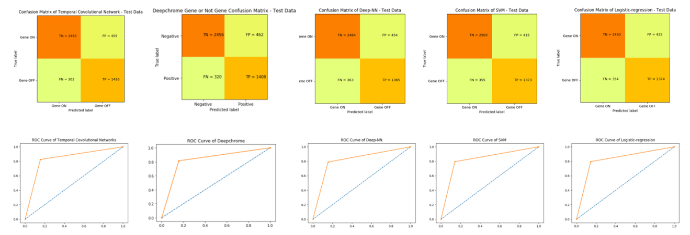

# Temporal Convolutional Network For Gene Expression

Temporal Convolutional Neural Network for predicting gene expression based on Histone Modification (HM) data

output, our approach result in a great result compare with DeepChrome, Deep Neural Network, SVM and Linear Regression

